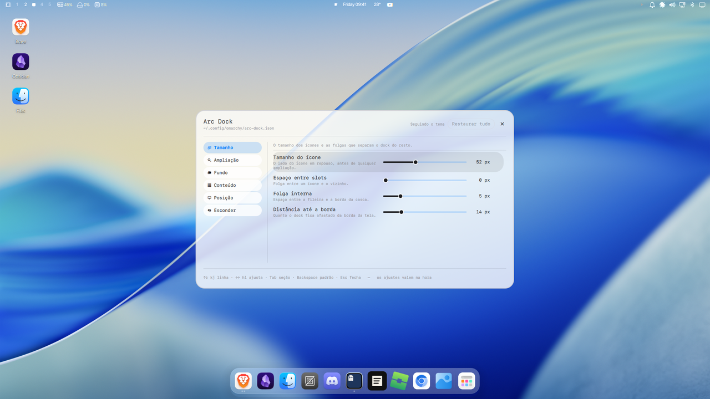

# Arc Dock

Dock para o [Omarchy](https://omarchy.org/) shell (Quickshell), com a aparência
do dock do macOS: vidro fosco, ampliação sob o ponteiro, um slot por app.


## Requisitos

- Omarchy 4 com a shell (Quickshell) — o plugin só usa `qs.Commons`/`qs.Ui` e
  o que vem no pacote (`hyprctl`, `omarchy-menu`, `omarchy-shell`).
- Hyprland com `decoration:blur` ligado, para o vidro fosco. Sem blur o dock
  funciona igual, só fica com a casca cheia (a janela de ajustes avisa).

## Instalação

```bash
git clone https://github.com/claudsondouglas/arc.dock ~/.config/omarchy/plugins/arc.dock
omarchy-shell shell rescanPlugins
omarchy plugin enable arc.dock
omarchy restart shell
```

Botão direito na casca abre os ajustes.

## O que ele é



**Slots fixáveis e reordenáveis, com apps recentes, auto-hide e janela de
ajustes.** Uma superfície ancorada numa borda da tela, na camada `Top` (por cima
das janelas, sem reservar espaço), com o fundo em **vidro fosco** e a
**ampliação** sob o ponteiro — os dois ajustáveis, inclusive para voltar ao
fundo cheio do tema. Ela
aparece numa **tela só** — por padrão a de maior área do setup, escolhida em
tempo de execução, então não há nome de monitor fixado no código. Dentro dela, a
fileira é três grupos — **os apps com slot** (fixados e abertos), **os
recentes** e o **botão de apps** —, separados por um filete cada:

- um slot por **app**, não por janela — duas janelas do mesmo `appId` dividem o
  mesmo slot;
- um app **fixado** ocupa slot mesmo fechado, e os fixados abrem a fileira, na
  ordem em que foram fixados;
- o slot sai do ícone: 52 px de ícone (ajustável) + 4 px de folga de cada lado
  = 60 px, e o comprimento do dock sai da contagem de slots;
- sem nenhum app aberto sobra o botão de apps, que é o que segura o tamanho
  mínimo; desligado ele também, um slot vazio impede o dock de colapsar;
- cada **filete** só existe quando há grupo dos dois lados dele: sem recente
  nenhum sobra um filete, e sem app nenhum não sobra nenhum — ele nunca vira um
  risco solto na ponta do dock;
- os cantos são concêntricos: o raio do slot é o do dock (`decoration:rounding`
  do Hyprland) menos os 6 px de folga entre os dois, então as duas curvas correm
  paralelas em qualquer tema;
- o estado do app fica num **ponto** ao lado do ícone, do lado que encosta na
  borda da tela (embaixo num dock de baixo, à esquerda num dock à esquerda):
  o diâmetro sai da folga do ícone, então o ponto ocupa exatamente a faixa que
  sobra entre o ícone e a borda do slot, sem pedir espessura extra no dock;
- um ponto por janela, com teto de dois: uma janela mostra um ponto, duas ou
  mais mostram dois — o que interessa é "tem mais de uma", e a folga entre os
  pontos sai do próprio diâmetro deles;
- um fixado e fechado fica **sem ponto**: é a ausência dele que diz que o app
  está fechado, sem precisar de uma segunda marca só para esse caso;
- o app em foco pinta os pontos com o `accent` do
  tema, e os demais ficam no `muted` — as duas cores vêm do `colors.toml`, então
  trocar de tema troca a marcação junto;
- a casca do slot é igual em todos: quem marca estado é o ponto, e não o
  preenchimento, para o mesmo app não ser marcado duas vezes;
- o slot mostra o **ícone do app**, tirado da entrada `.desktop` (o `appId` da
  janela é resolvido pelo `heuristicLookup` do Quickshell) e transformado em
  arquivo pelo `appLibrary` da shell — o mesmo índice que o menu usa, então um
  app instalado com a shell no ar aparece com ícone sem reiniciar nada;
- sem entrada `.desktop` (ou com um ícone que não carrega) o slot cai na
  inicial do nome do app;
- o **contador de notificações** é um disco vermelho com número no canto de
  cima à direita do ícone, como no dock do macOS (ver a seção abaixo).

A **borda** é escolhida nos ajustes: abaixo (o padrão), acima, à esquerda ou à
direita. Numa borda lateral a fileira corre de cima para baixo, o filete vira
horizontal, os pontos de estado migram para o lado que encosta na tela, o menu
de contexto abre para o lado de dentro e o arrasto de reordenação passa a medir
o eixo vertical — a geometria toda é escrita em *comprimento* (ao longo da
borda) e *espessura* (atravessando), e só a janela traduz os dois de volta para
largura e altura.

Clicar num slot vai para o app: com uma janela só é ativá-la, com mais de uma o
clique percorre a fila a partir da que está em foco. Num fixado que está fechado
o clique **abre** o app, pelo mesmo caminho que a shell usa
(`uwsm-app -- gtk-launch`), então ele não nasce preso ao processo da shell e uma
entrada com `Terminal=true` abre no terminal.

O **botão direito** abre o menu de contexto do app, numa superfície própria
acima do dock (a janela do dock tem o tamanho exato do dock, então o menu não
caberia dentro dela):

- o cabeçalho nomeia o app, e o menu fecha ao clicar fora — enquanto ele está no
  ar o slot de origem fica aceso;
- primeiro o que **abre**: as ações declaradas pela entrada `.desktop` do app
  ("Nova janela privativa", "Compor mensagem"...) mais um "Nova janela"
  genérico, omitido quando o próprio app já declara uma ação de mesmo nome;
- depois o que **navega**: uma linha por janela aberta, só quando há mais de
  uma, com a janela em foco marcada no `accent` do tema;
- em seguida **"Fixar na dock"** / **"Desafixar da dock"**, no próprio grupo:
  fixar é propriedade do dock, não do app. O item só aparece para quem tem
  entrada `.desktop` — sem ela o dock não teria como reencontrar o app na
  próxima sessão;
- por último o que **fecha**, longe do topo onde o ponteiro chega primeiro;
- a lista rola dentro do menu quando um app tem janelas demais para a tela.

## Notificações

Cada slot pode carregar um **contador**: um disco no `urgent` do tema (o
vermelho do `colors.toml`) com um número branco, no canto de cima à direita do
ícone — em qualquer borda do dock, porque é ali que o olho aprendeu a procurar.
O diâmetro é pouco mais de um terço do ícone, a proporção do dock do macOS, e o
disco cresce junto com o ícone na ampliação.

O número é **quantas notificações do app chegaram desde a última vez que ele
esteve em foco**. É a única leitura que o dock tem como sustentar: no macOS
cada app diz o próprio número (mensagens não lidas, e-mails por abrir), e aqui
nenhum app fala com o dock. Daí as regras:

- uma notificação chega, o número sobe; o app **ganha o foco**, o número some;
- notificação do app que **já está em foco** não conta — o usuário está olhando
  para ele;
- notificação silenciada pelo **"não perturbe"** conta do mesmo jeito: é
  justamente a que o usuário vai querer encontrar depois;
- o remetente **retirar** a notificação desconta — é o que os apps de chat
  fazem quando a mensagem foi lida no telefone. Fechar o toast, ou ele
  expirar, não desconta: não diz que o app foi visto, e o macOS também não
  desconta por isso;
- transitórias (a dica `transient`) não contam: o remetente pediu que não
  ficassem;
- o slot **sair da fileira** leva o contador junto; sem slot não há onde
  contar, como um app fora do dock no macOS;
- a conta mora na memória da shell: um `omarchy restart shell` zera tudo.

Quem recebe as notificações é o serviço `omarchy.notifications` da shell — o
nome D-Bus é um só, então o dock não sobe servidor nenhum: alcança o da shell
e escuta o mesmo sinal que ele. A notificação é casada com o slot pela dica
`desktop-entry` quando ela vem (é o mesmo id de que a chave do slot é
derivada) e, na falta dela, pelo nome do app, de forma frouxa: "Slack" casa
com `slack`, "Telegram Desktop" com `org.telegram.desktop`, "Google Chrome"
com `google-chrome`.

O contador se desliga em **Conteúdo → Contador de notificações**.

## Recentes

Depois dos apps com slot vêm os **recentes**: os últimos apps que o usuário
abriu e já fechou, na ordem em que ele os abriu — quatro por padrão, ajustável de
0 (desligado) a 12. Um clique reabre o app, e ao reabrir ele sai dos recentes e
vira um slot como os outros.

A regra é "um app, um slot": quem já tem lugar não aparece aqui. O **aberto**
está no grupo da esquerda e o **fixado** tem lugar próprio, então fechar um app
é o que faz ele aparecer nos recentes, e fixá-lo é o que o tira de lá — o que
também quer dizer que desafixar um app fechado o remove do dock de vez, em vez
de devolvê-lo como recente. Um recente cuja entrada `.desktop` sumiu (o app foi
desinstalado) fica de fora em vez de virar um slot em branco, e o menu de
contexto dele ganha **"Remover dos recentes"**, que é a porta de saída do único
slot que o usuário não pediu.

O histórico é gravado com os fixados, no mesmo arquivo e no mesmo formato, e vai
até o teto do ajuste (12) e não até o valor de hoje: baixar a contagem para 2 e
voltar para 6 não joga fora, no caminho, os apps que o usuário esperava
reencontrar.

Os fixados e os recentes são gravados em
`~/.local/state/omarchy/arc-dock.json` — estado do usuário, no mesmo diretório
em que os outros plugins da shell guardam o deles. Cada item é `{ key, entry }`:
a chave que agrupa as janelas do app e o id da entrada `.desktop`, que é o que
desenha o ícone e abre o app enquanto não há janela nenhuma. As duas listas
ficam no mesmo arquivo porque são a mesma pergunta — quem ocupa a fileira — e
porque um app se muda de uma para a outra ao ser fixado.

**Arrastar** um slot fixado na horizontal reordena o grupo dos fixados, e a
ordem nova é gravada no mesmo arquivo — ela é a ordem de `pinned`, então o dock
volta com ela na sessão seguinte. Só os fixados se movem: os abertos seguem a
ordem em que apareceram, e os recentes a ordem em que foram abertos. O slot pego
não sai do grupo (o deslocamento é grampeado ao intervalo dos fixados), a troca
acontece a meio passo do vizinho, e
um gesto abaixo do limiar continua valendo como clique. Uma janela que abre no
meio do arrasto **aborta** o gesto: o `Repeater` recria os slots e o que estava
na mão deixaria de existir, então é melhor perder o arrasto que gravar uma ordem
largada pela metade.

## Sair quando estorva

Quando o dock estorva é uma escolha de quatro valores (`Nunca`, `Em tela cheia`,
`Janela embaixo` — o padrão — e `Sempre`); o resto do esconder é o mesmo caminho
para as quatro.

Em `Em tela cheia`, com um app ocupando a tela (maximizado ou em tela cheia) no workspace
ativo do monitor do dock, a casca desliza para fora e sobra só uma faixa na
borda — a mesma folga de 14 px que o dock já deixava ali. Encostar o ponteiro
nela devolve o dock **na hora**; sair dele só o recolhe depois de meio segundo
de carência (ajustável), para um ponteiro de passagem não fazer o dock fugir de
baixo do cursor. O dock também fica de pé enquanto o menu de contexto está
aberto ou um slot está sendo arrastado.

A verdade vem de `hasFullscreen` do workspace ativo do monitor do dock, e não da
janela em foco — o foco pode estar num diálogo flutuante por cima do app que
tomou a tela. O Quickshell não reconsulta os workspaces no evento `fullscreen`
do Hyprland, então o dock escuta esse evento e pede o refresh; como fechar uma
janela em tela cheia também o emite, ele é o único evento necessário.

`Janela embaixo` responde a mesma pergunta pela geometria, e não pela tela
cheia: num WM de tiling dois apps lado a lado ocupam a mesma área sem nenhum
deles estar em tela cheia. O dock compara o retângulo em que ele se assenta —
o de **repouso**, senão esconder-se já o descobriria e ele voltaria no quadro
seguinte — com o `at`/`size` de cada janela do workspace ativo do monitor, nas
coordenadas do layout do Hyprland. Qualquer sobreposição já o tira de cena.

Essa geometria não chega sozinha: o `lastIpcObject` de cada toplevel só é
trocado quando alguém pede a consulta. O dock a pede (`refreshToplevels`,
coalescida por um timer de 60 ms) nos eventos que reacomodam a tela — abrir,
fechar, mover, (des)flutuar, agrupar, trocar de workspace ou de monitor. A troca
de foco fica **de fora** de propósito: o Hyprland emite `activewindow` junto com
cada troca de título, e um terminal com relógio no título pediria uma consulta
por segundo, para sempre.

Sobra um gesto sem evento nenhum — arrastar a divisa de um split não emite nada,
e o Hyprland não tem evento de redimensionar. Quem corrige a conta nesse caso é
o próprio ponteiro: encostar no dock (ou sair dele) pede a consulta de novo, que
é justamente quando ela vai ser lida.

A janela não muda de tamanho para esconder: o que desliza é o conteúdo, e o que
muda é a máscara de input — escondido, só a faixa de gatilho recebe ponteiro, e
o resto passa clique para o app embaixo.

Ainda não existe: badges.

## Ampliação

Ligada por padrão. Com ela o dock responde ao ponteiro com uma **onda**: o
ícone embaixo do cursor cresce e **sobe acima da casca**, os vizinhos crescem
menos conforme se afastam dele, e a fileira se abre para caber o que cresceu —
o gesto do dock do macOS.

- o **peso** da onda é um cosseno levantado: 1 debaixo do ponteiro, 0 na ponta
  do alcance, e chegando aos dois extremos com inclinação zero — sem quina no
  pico nem na borda do alcance;
- o **deslocamento** de cada célula é a integral desse mesmo peso, e é isso que
  garante que ninguém se sobreponha: cada ícone anda exatamente o que os
  vizinhos entre ele e o cursor engordaram, nem mais nem menos;
- o ícone fica **assentado e sobe**: o lado que encosta na borda da tela não se
  mexe, então o ponto de estado continua onde estava e todo o crescimento vai
  para o lado de dentro;
- o **filete** anda com a onda mas não cresce com ela — um separador que
  engorda vira uma barra —, e o botão de apps é uma célula como as outras;
- seguindo o ponteiro a escala não é animada: ela é função de onde o cursor
  está, e animá-la só faria a onda chegar depois da mão. A volta ao repouso,
  essa sim, assenta no mesmo tempo do realce de ponteiro (140 ms);
- **arrastando**, a onda sai de cena: o arrasto já move os slots, e duas
  translações disputando a mesma fileira deixariam o slot pego escorregando de
  lado enquanto o dedo o segura parado.

A casca cresce e encolhe, mas a **janela não**: cada mudança de tamanho de uma
superfície de layer é uma ida e volta com o compositor, e o ponteiro pediria
uma por quadro. A janela nasce com a reserva máxima que a onda chega a pedir —
ao longo da borda para o espalhamento, atravessando-a para o ícone subir —, toda
transparente, e a casca se abre para dentro dela. Com os padrões (125%, alcance
de 2 slots, ícone de 52 px) isso são 26 px de comprimento e 10 px de espessura;
desligada, a reserva é zero e a janela volta a ter o tamanho exato do dock.

Dois ajustes mandam nela: o **tamanho no pico** (110% a 200%) e o **alcance**
(1 a 4 slots de cada lado). O alcance é contado em slots, e não em pixels, para
acompanhar sozinho uma troca de tamanho de ícone ou de espaçamento do tema.

## Vidro fosco

Ligado por padrão, o **vidro** troca o fundo cheio da casca por um translúcido
(25% por padrão, ajustável de 10 a 100) e pede ao Hyprland que desfoque o que
passa por trás dela. As duas metades são necessárias: translucidez sozinha
deixaria as janelas de trás nítidas através do dock, e o blur sozinho não teria
o que atravessar.

O menu de contexto **não** vai junto: ele fica no tom de popup do tema, do jeito
que o tema o entregar, e o blur da regra não o alcança. A casca do dock carrega
ícones, que se leem por cima de qualquer coisa; o menu é uma folha de texto, e
sobre vidro cada rótulo disputa contraste com o que passa atrás. Quem decide o
material dele é o tema (`popups.background`), não o ajuste do dock.

O filete separador vai junto, e por um motivo a mais: com o vidro a casca não
tem cor fixa — ela mostra o que passa por trás, então é clara sobre um fundo de
tela claro e escura sobre um escuro, e nenhuma cor sozinha se vê nos dois. Uma
linha só ou fica dura (cor cheia) ou some (cor com alfa). No vidro ele vira um
par de linhas, texto e fundo do popup, que são as duas pontas da superfície e
por definição do tema contrastam entre si: uma delas sempre aparece, e nenhuma
precisa ser opaca para isso. É o mesmo bisel que o macOS usa em separador sobre
vidro. As pontas se dissolvem — elas são onde o filete encontra a folga da
casca, e uma linha cortada seca ali marca a folga em vez de separar os grupos.

A borda vai junto: no vidro ela deixa de ser *cor* e passa a ser *luz*. A cor do
tema (`popups.border`) vem opaca, e numa casca em que todo o resto é translúcido
ela fica sendo a única coisa sólida do dock — uma linha desenhada por cima do
vidro, que não recebe nada do que passa atrás. Então do tema fica só a
espessura, que cai para um fio (um tema que declare `popups.border-width`
continua mandando), e a linha vira o reflexo de aresta do vidro do macOS: um
gradiente na diagonal, cheio no canto superior esquerdo, morrendo ao longo das
arestas de cima e da esquerda, nada embaixo e à direita, e um reflexo mais
fraco no canto oposto. Não há linha escura na base — quem assenta a peça é a
sombra (ver abaixo). Por dentro da borda o dock inclina a luz na face: clareia
em cima e assenta embaixo (`ArcGlass.qml`). Tudo isso é vertical (ou diagonal)
mesmo com o dock ancorado na esquerda ou na direita: é a única coisa do plugin
que não se escreve em comprimento e espessura, porque a luz vem de cima da tela
e não da borda em que o dock encostou.

O fosco é uma `layerrule` do compositor, pedida pelo próprio dock em tempo de
execução — um ajuste que só funcionasse depois de editar o `looknfeel.lua` à mão
não seria um ajuste. Ela é declarada com **nome** (`arc-dock-glass`): no parser
Lua do Hyprland, redeclarar o mesmo nome substitui a regra anterior em vez de
empilhar mais uma, e é isso que deixa o vidro ser desligado sem um `hyprctl
reload` — que levaria junto tudo o mais que o usuário tenha ajustado em tempo de
execução. Um `hyprctl reload` de terceiros (o `omarchy theme set` faz um no fim)
apaga a regra, então o dock escuta `configreloaded` e a repõe.

O blur ignora tudo abaixo de um piso de alfa. Sem ele o compositor desfocaria
também a folga transparente entre a casca e a borda da tela — um bloco fosco
retangular em volta de um dock de cantos redondos. O piso sai da metade da menor
opacidade que o ajuste permite: acima de zero, então a folga fica de fora, e
abaixo de qualquer alfa que a casca chegue a ter, então a casca sempre entra.

Com `decoration:blur` desligado no Hyprland a regra é aceita e não faz nada — a
casca fica translúcida sem ficar fosca. O dock consulta `hyprctl getoption` e a
janela de ajustes diz isso em vez de deixar o interruptor parecendo quebrado.

## Sombra

A casca projeta uma penumbra, para não ficar pousada na tela sem peso. Ela sai
de `menu.scrim` — o tom com que o tema escurece o que está atrás de uma
superfície dele —, e alcança tanto quanto o arredondamento da casca: a sombra de
uma peça é da ordem da curva dela, então um tema de cantos mais fechados projeta
menos.

Três escolhas de implementação valem o registro:

**Ela é uma pilha de anéis de um pixel, não um borrão por baixo da casca.** O
miolo precisa ficar vazio: com o vidro ligado a casca deixa passar o que está
atrás dela, inclusive a própria sombra, e um retângulo escuro embaixo
escureceria o vidro em vez de erguê-lo.

**Ela é projetada para baixo**, um terço do alcance, seja qual for a borda em
que o dock ancorou: é sombra de uma luz que vem de cima da tela, e é ela que
assenta a peça no lugar de uma linha escura na base. Com a queda os anéis de
dentro entrariam na silhueta da casca por cima, e o vidro os mostraria; uma
máscara (`MultiEffect`) recorta a silhueta da pilha, e o miolo continua vazio.

**Ela mora numa janela própria** (`arc-dock-shadow`), e não na do dock, por
causa do blur. A regra do vidro desfoca tudo o que na superfície passar do piso
de alfa, e uma penumbra acima do piso viraria uma auréola fosca com um limite
duro onde a alfa cruza o piso; abaixo do piso ela caberia na janela do dock, mas
aí seria fraca demais para ser sombra. Como a regra casa `^(arc-dock)$` inteiro,
um namespace ao lado já fica de fora dela. As duas janelas leem o mesmo
`bodyOffset`, então o esconder não tem dois estados para sincronizar, e a
superfície da sombra tem região de input vazia — ela nunca recebe ponteiro.

## Ajustes


O **botão direito** na casca do dock — no botão de apps, ou em qualquer folga
entre os slots — abre a janela de ajustes. Ela é o segundo ponto de entrada do
mesmo plugin (`kind: panel` no manifesto), então o host injeta nela o serviço
vivo e os controles escrevem direto no dock: não há "aplicar" nem "cancelar",
porque a pré-visualização *é* o resultado.

O formato é o do [Omaland](https://github.com/bobbynicholas/omaland), o painel
de ajustes do Hyprland: uma **trilha de seções** à esquerda e uma **página de
linhas** à direita, cada linha com o nome e a explicação de um lado e o controle
do outro. A marca `·` ao lado de uma seção diz que há coisa fora do padrão lá
dentro, sem obrigar a entrar em cada uma para conferir.

| Seção | O quê |
| --- | --- |
| Tamanho | tamanho do ícone, espaço entre slots, folga interna, distância até a borda |
| Ampliação | a onda sob o ponteiro, o tamanho no pico e o alcance dela |
| Fundo | o tom da casca, o vidro fosco e a opacidade dela |
| Conteúdo | botão de apps, filete separador, pontos de estado, a marca de app aberto, o contador de notificações e quantos apps recentes |
| Posição | borda da tela e monitor (automático, ou um nome de saída) |
| Esconder | quando sair de cena, carência para recolher, duração do deslize |

A janela é dirigida pelo teclado inteiro, porque quem abre ajustes de dock quase
sempre está com a mão nele:

| Tecla | O quê |
| --- | --- |
| `↑` `↓` ou `k` `j` | anda pelas linhas da seção |
| `←` `→` ou `h` `l` | mexe no valor da linha: liga/desliga, o vizinho da lista, um passo do número |
| `Enter` / `Espaço` | vira o interruptor, ou avança a escolha |
| `Tab` / `Shift+Tab` | troca de seção |
| `Backspace` | devolve a linha ao padrão |
| `Esc` | fecha |

Os valores ficam em `~/.config/omarchy/arc-dock.json` — **config**, ao lado do
`shell.json`, e não estado (os fixados e os recentes continuam em
`~/.local/state`, que é outra natureza de dado). O arquivo é lido com
`watchChanges`, então editá-lo à mão vale na hora, e o que estiver fora de faixa
é grampeado em vez de quebrar o dock.

Uma chave *ausente* não é zero: é "siga o tema". O espaçamento interno sai do
`Style`, então trocar de tema reajusta o dock sozinho enquanto o usuário não
tiver mexido naquela medida. O botão de desfazer de cada linha — e o "Restaurar
tudo" do cabeçalho — **apagam** a chave em vez de gravar o número que hoje é
padrão, justamente para devolver essa ligação. Enquanto uma chave está fora do
padrão ela ganha um ponto no `accent` do tema ao lado do nome, e o valor dela
aparece no mesmo `accent`; o cabeçalho conta quantas são.

Também dá para abrir por IPC, que é o caminho para amarrar num atalho do
Hyprland:

```bash
omarchy-shell shell toggle arc.dock '{}'
```

## Arquivos

| Arquivo | O quê |
| --- | --- |
| `Arcdock.qml` | superfície (`PanelWindow`), geometria e o modelo de slots |
| `ArcConfig.qml` | os ajustes e o arquivo em que eles moram |
| `ArcSettings.qml` | a janela de ajustes (`kind: panel`) |
| `ArcSlot.qml` | um slot: espaço, ícone, inicial de fallback, o ponto de estado e o contador de notificações |
| `ArcLauncher.qml` | o botão que abre o menu de apps do Omarchy |
| `ArcMenu.qml` | o menu de contexto de um slot (popup própria) |
| `ArcGlass.qml` | a luz do vidro: a face que clareia em cima e assenta embaixo |
| `ArcShadow.qml` | a penumbra, em anéis de um pixel, projetada para baixo |

## Desenvolvimento

Depois de editar qualquer `.qml`, rode `omarchy restart shell`. O hot reload
do Omarchy recarrega o código mas não reaplica a geometria da `PanelWindow`.

Para conferir que a versão nova está no ar:

```bash
hyprctl layers | grep arc-dock
```

Com os ajustes no padrão, o comprimento esperado é
`10 + slots*60 + filetes + 60` px (o espaço entre slots é zero), onde `slots`
conta os fixados, os abertos e os recentes — então dá para validar a fileira
sem depender do olho. A espessura é `70`, e a janela leva mais `14` px de folga
até a borda.

## Licença

MIT.
