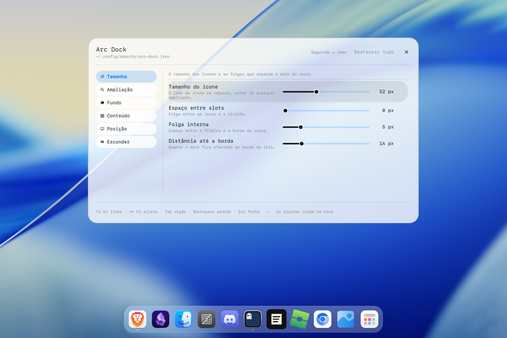
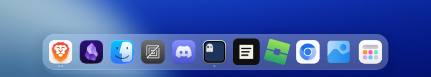
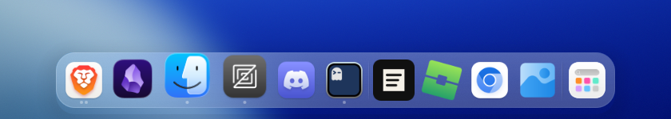
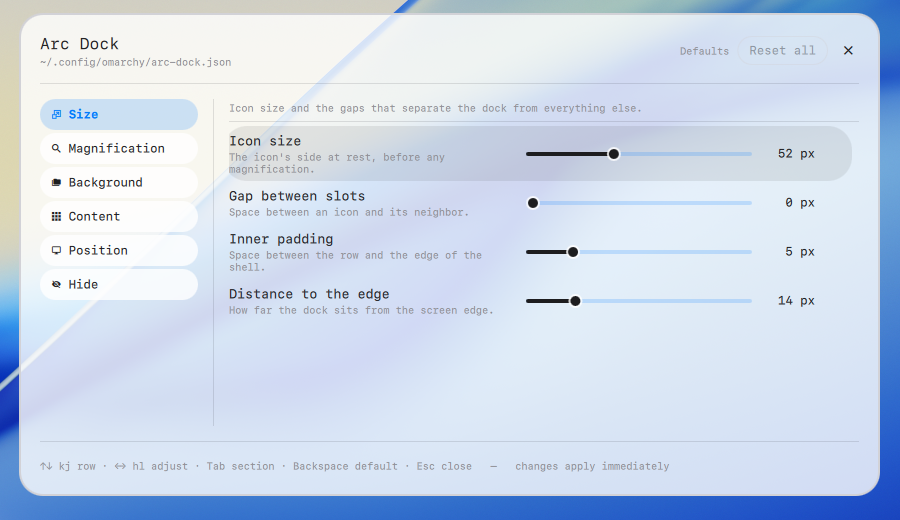

# Arc Dock

A dock for the [Omarchy](https://omarchy.org/) shell that looks like the macOS
dock: frosted glass, magnification under the pointer, one slot per app.



The icons in the screenshots come from the
[MacTahoe icon theme](https://github.com/vinceliuice/MacTahoe-icon-theme).
The dock uses whatever icon theme the shell is set to.

## Install

```bash
omarchy plugin add https://github.com/claudsondouglas/arc.dock.git --enable
```

If the dock does not show up right away, run `omarchy restart shell`.
Right-click the dock to open its settings.

Frosted glass needs `decoration:blur` enabled in Hyprland. Without it the dock
still works, the shell just stays translucent instead of frosted.

### Enable, disable, update, remove

```bash
omarchy plugin enable io.github.claudsondouglas.arcdock     # turn it on
omarchy plugin disable io.github.claudsondouglas.arcdock    # turn it off, keep the files
omarchy plugin update io.github.claudsondouglas.arcdock     # pull the latest version
omarchy plugin remove io.github.claudsondouglas.arcdock     # delete the plugin
```

Disabling keeps your settings and pinned apps. Removing deletes the plugin
folder but leaves `~/.config/omarchy/arc-dock.json` and
`~/.local/state/omarchy/arc-dock.json` in place; delete those too if you want a
clean slate.

## What you get





### Slots

One slot per app. Windows with the same `appId` share it, so five terminal
windows are one icon. The icon comes from the app's `.desktop` entry; without
one, the slot shows the first letter of the app name.

A dot under the icon says the app is open, two dots say it has two or more
windows. The focused app's dots use the theme accent, the others use the muted
color. A pinned app that is closed shows no dot.

Left-click activates the app. With several windows the click cycles through
them, starting from the focused one. On a closed pinned app it launches the
app.

### Context menu

Right-click on a slot opens a menu with, in order: the actions the app
declares in its `.desktop` file ("New private window", "Compose message") plus
a generic "New window"; one line per open window when there is more than one,
with the focused window marked; pin or unpin; and close. Recents also get a
"Remove from recents" entry.

### Pinned apps

Pin an app from its context menu and it keeps its slot while closed. Pinned
apps come first in the row, and you can drag them to reorder. The order is
saved and comes back next session. Only pinned apps can be dragged; open and
recent apps keep the order they appeared in.

### Recent apps

After the pinned and open apps come the last ones you closed, in the order you
opened them. A click reopens the app, and it moves back to the main group. Four by
default, adjustable up to 12, or zero to turn the group off. Pinning an app
takes it out of the recents; an app that was uninstalled drops out on its own.

### Notification counter

A red disc with a white number at the top right corner of the icon, counting
the notifications that arrived since the app was last focused. Focusing the
app clears it. Notifications silenced by do-not-disturb still count, since
those are the ones you will want to find later. Notifications for the app you
are already looking at do not. The count lives in memory, so `omarchy restart
shell` clears it. Turn it off under Content.

### Magnification

The icon under the pointer grows and rises above the shell. Neighbors grow
less the farther they are, and the row opens up to make room, like the macOS
dock. Two settings: the size at the peak (110% to 200%, 125% by default) and
the reach (1 to 4 slots on each side, 2 by default). Off, the dock is a fixed
size.

### Frosted glass

The shell is translucent (25% by default, 10% to 100%) and blurs what passes
behind it. The dock asks Hyprland for the blur rule itself, so there is nothing
to add to your Hyprland config, and it puts the rule back after a config
reload. The shell tone can follow the theme or be fixed light or dark, so you
can have a dark dock on a light theme. The border and the separator between
groups turn into light on glass, with a soft shadow underneath.

### Hiding

Four modes under Hide: never, in fullscreen, when a window sits underneath
(the default), or always. When hidden, a thin strip at the screen edge
remains; touching it with the pointer brings the dock back immediately.
Leaving the dock hides it again after half a second, adjustable, so a passing
pointer does not make it flee. The dock stays up while a context menu is open
or you are dragging a slot.

### Position and size

Any edge: bottom, top, left or right. On a side edge the row runs vertically
and the dots, menu and drag follow. The dock shows on one screen, the largest
one by default, or the one you name. Icon size, gap between slots, inner
padding and the distance to the screen edge are all settings. Corner radius
and colors come from the active theme, so switching themes restyles the dock.

## Settings



Right-click on the dock shell (the app button or any gap between slots) opens
the settings window. Changes apply as you make them; there is no apply button.

| Section | What |
| --- | --- |
| Size | icon size, gap between slots, inner padding, distance to the edge |
| Magnification | on/off, peak size, reach |
| Background | shell tone, frosted glass, opacity |
| Content | app button, separator, state dots, notification counter, how many recents |
| Position | screen edge, monitor |
| Hide | mode, grace before hiding, slide duration |

The window is keyboard driven:

| Key | What |
| --- | --- |
| `↑` `↓` or `k` `j` | move between rows |
| `←` `→` or `h` `l` | change the value |
| `Enter` / `Space` | toggle, or advance a choice |
| `Tab` / `Shift+Tab` | switch section |
| `Backspace` | reset the row to its default |
| `Esc` | close |

Values live in `~/.config/omarchy/arc-dock.json`. Editing the file by hand
takes effect immediately, and out-of-range values are clamped. A missing key
means the default; the reset buttons delete the key rather than writing the
default value. Pinned apps and recents are stored separately, in
`~/.local/state/omarchy/arc-dock.json`.

To bind the settings window to a Hyprland shortcut:

```bash
omarchy-shell shell toggle io.github.claudsondouglas.arcdock '{}'
```

## Next steps

Two things are planned:

- Keyboard control: a shortcut to bring the dock into focus, then arrows to
  move between icons, Enter to open and W to close.
- Folders in the dock: pin a directory as a slot, so a click opens it in the
  file manager.

## Development

The plugin lives in `~/.config/omarchy/plugins/io.github.claudsondouglas.arcdock`. After editing any
`.qml`, run `omarchy restart shell`: hot reload picks up the code but not the
`PanelWindow` geometry. `hyprctl layers | grep arc-dock` shows the dock window
and its size. The code comments explain the design decisions.

## License

MIT.
